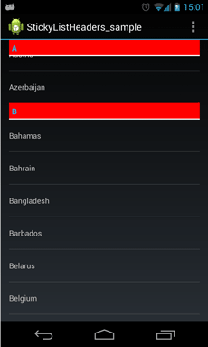

Android上的分组ListView
=======
今天想学EverNote那样做个分组的ListView，就像下面这样

感觉应该很容易的，网上翻了翻才发现并不容易。
回想2011年接触iOS开发的时候，iOS就支持这样的显示风格了，到今天Android还是没有原生支持。
[GitHub](https://github.com/emilsjolander/StickyListHeaders)上找到一个实现好像还可以，上面的示例图片就是从那里弄的。

如切如磋，如琢如磨
