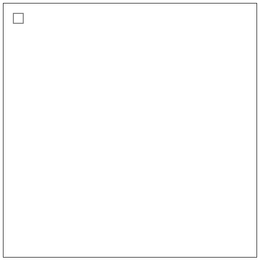

#canvas大小
遇到一个诡异的问题，如下代码
```html
<!DOCTYPE html>
<html lang="en">
<head>
    <meta charset="UTF-8">
    <title>Title</title>
</head>
<body>
<canvas id="myCanvas" style="width:512px;height:512px;border: 1px solid"></canvas>
</body>
<script>
        var c = document.getElementById("myCanvas");
        var ctx = c.getContext("2d");
        ctx.strokeRect(20, 20, 20, 20);
</script>
</html>
```
画出来的居然不是正方形，效果如下

研究发现，canvas的大小要直接通过width和height属性来指定
也就是说，这样才行
```html
<!DOCTYPE html>
<html lang="en">
<head>
    <meta charset="UTF-8">
    <title>Title</title>
</head>
<body>
<canvas id="myCanvas" width="512px" height="512px" style="width:512px;height:512px;border: 1px solid"></canvas>
</body>
<script>
        var c = document.getElementById("myCanvas");
        var ctx = c.getContext("2d");
        ctx.strokeRect(20, 20, 20, 20);
</script>
</html>
```
正确结果

